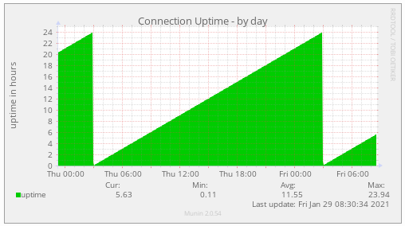
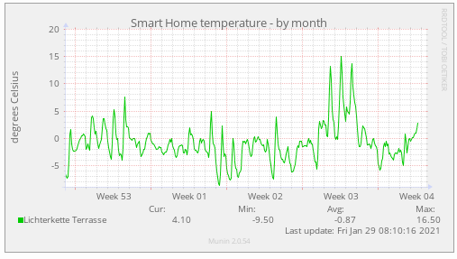

# Munin Plugins for FRITZ!Box


A collection of [Munin](https://munin-monitoring.org) plugins to monitor your [AVM FRITZ!Box](https://avm.de/produkte/fritzbox/) router.  
The values are retrieved via the [fritzconnection](https://pypi.org/project/fritzconnection/) project.

So far the following FRITZ!Box models have been confirmed working:
- FritzBox 7590 with FRITZ!OS Version 7.28 to 7.57
- FritzBox 7530 AX with FRITZ!OS Version 7.80 to 8.00

If you are using the scripts on a different FRITZ!Box model please let me know by

- opening an issue
- submitting a pull request

## Purpose of this Fork

These scripts are build upon the original [fritzbox-munin](https://github.com/Tafkas/fritzbox-munin) with the goal to make 
use of the more modern APIs that FRITZ!OS 7 provides.

The main differences to the original version are:
- Compatibility with latest FRITZ!OS version using username/password authentication
- No HTML scraping
- All data is fetched either through the TR-064 interface or the JSON API
- Contrary to the original version this fork uses multigraphs: this removes the need to query the same API endpoint multiple times, all multigraph plugins have configuration options to switch individual graphs on and off
- Support for Smart Home devices, e.g. for measuring temperature
- Complete refactoring of the Python code base to make it more robust, use modern language features like type hinting, tests and remove code duplication
- Added possibility to connect to FRITZ!Box via TLS
- Added automated testing via GitHub Actions

## Requirements
- FRITZ!Box router with FRITZ!OS >= 7.50 (if you are on an older FRITZ!OS version, select an older version of fritzbox-munin-fast by browsing the tags in this repository)
- Munin 1.4.0 or later is required
- Python >= 3.9
   
## Available Plugins

### Connection Uptime
Plugin: `fritzbox_connection_uptime.py`  
Shows the WAN connection uptime.  


### DSL Errors
Plugin: `fritzbox_dsl.py`  
Multigraph plugin, showing:
 - DSL checksum errors
 - DSL transmission errors
 - line loss
 - link capacity
 - error correction statistics
 - signal-to-noise ratio

### CPU & Memory
Plugin: `fritzbox_ecostat.py`  
Multigraph plugin, showing:
 - memory usage
 - CPU load
 - CPU temperature

### Smart Home
Plugin: `fritzbox_smart_home.py`  
Multigraph plugin, showing:
 - temperature sensors
 - switch states
 - power values
 - energy consumption values



### Energy
Plugin: `fritzbox_energy.py`  
Multigraph plugin, showing:
 - power consumption for CPU, WiFi, WAN, Fon, USB and total
 - devices connected on WiFi and LAN
 - system uptime

### Link Saturation
Plugin: `fritzbox_link_saturation.py`  
Multigraph plugin, showing saturation of WAN uplink and downlink by QoS priority

### Traffic
Plugin: `fritzbox_traffic.py`  
Similar to fritzbox_link_saturation, but single-graph and without QoS monitoring.

### Wifi
Plugin: `fritzbox_wifi_load.py`  
Multigraph plugin, showing for 2.4GHz and 5GHz
 - WiFi uplink and downlink bandwidth usage
 - neighbor APs on same and on different channels

## Installation & Configuration

1. To install requirements run

        pip install -r requirements.txt

1. Make sure the FRITZ!Box has UPnP status information enabled. (web interface: _Home Network → Network → Network Settings → Universal Plug & Play (UPnP)_)

1. Copy all the scripts from the [published release](https://github.com/ma4nn/fritzbox-munin-fast/releases) to `/usr/share/munin/plugins`

1. (optional) If you want to connect to FRITZ!Box using SSL, download the Fritz certificate (web interface: _Internet → Freigaben → FritzBox Dienste → Zertifikat → Zertifikat herunterladen_) and save it to `/etc/munin/box.cer`.
   The certificate might change after a FRITZ!Box Update.

1. Create entry in `/etc/munin/plugin-conf.d/munin-node`:

        [fritzbox_*]
        env.fritzbox_user <fritzbox_user>
        env.fritzbox_password <fritzbox_password>
        env.fritzbox_use_tls true
        host_name fritzbox
   
   See the plugin files for plugin-specific configuration options.

1. For each plugin you want to activate, create a symbolic link to `/etc/munin/plugins` and make it executable, e.g.:
   ```
   ln -s fritzbox_dsl.py /etc/munin/plugins/fritzbox_dsl.py && chmod +x /etc/munin/plugins/fritzbox_dsl.py
   ```

1. Restart the munin-node daemon: `service munin-node restart`.

1. Done. You should now start to see the charts on the Munin pages🥳

## Localization

The `fritzbox_energy.py` script depends on the language selected in your FRITZ!Box. Currently, two locales are
supported:

1. German: `de` (default)
2. English: `en`

You can change the used locale by setting an environment variable in your plugin configuration:

    env.locale en

## Different hosts for the FRITZ!Box and your system

You can split the graphs of your FRITZ!Box from the localhost graphs by following the next steps:

1. Use the following as your host configuration in `/etc/munin/munin.conf`

        [home.yourhost.net;server]
            address 127.0.0.1
            use_node_name yes

        [home.yourhost.net;fritzbox]
            address 127.0.0.1
            use_node_name no

1. Restart your munin-node: `service munin-node restart`

## Testing

### Manual Testing

To manually test a plugin use
```
munin-run --pidebug fritzbox_connection_uptime.py
```

### Unit Tests

Run all unit tests with
```
pytest --cov
```
